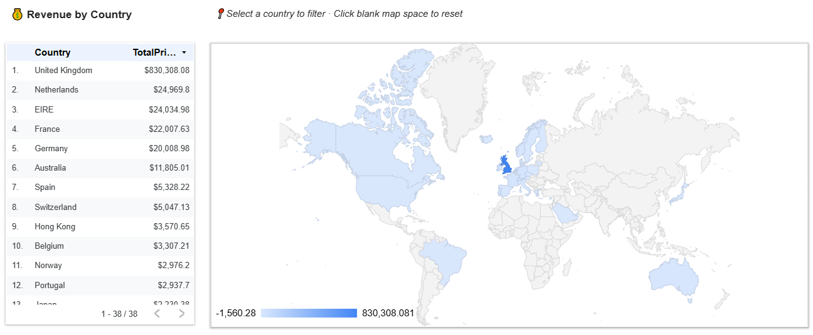
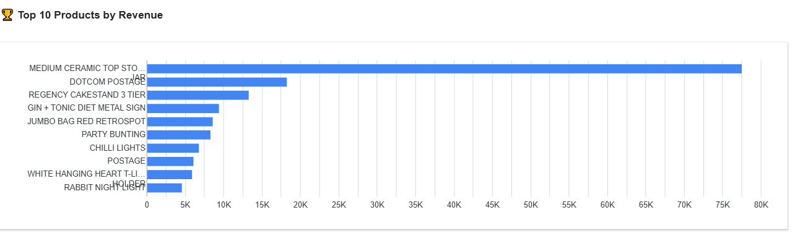

# 📊 eCommerce Looker Studio Dashboard (50K Records Sample via GCP & Kaggle)

This dashboard was built using **Google Looker Studio** to visualize a cleaned sample of an eCommerce dataset originally sourced from Kaggle. It provides insights into sales trends, customer behavior, product performance, and regional KPIs.

The project initially leveraged **Google Cloud Storage** and **BigQuery** for processing. To make the dashboard freely accessible without incurring public query costs, the data was extracted and used as a cleaned CSV (50K records).

---

## 📍 Live Dashboard  
👉 [View on Looker Studio](https://lookerstudio.google.com/u/0/reporting/f16be1e0-4668-4a6d-a952-6a0e2f1704da/page/IBnQF)

---

## 📷 Dashboard Previews

### 🔹 Performance Overview  

### 🔹 Interactive Country Map  

### 🔹 Top Products  

---

## 📚 Data Source

The original dataset is publicly available on Kaggle:  
[🗂️ eCommerce Data by carrie1](https://www.kaggle.com/datasets/carrie1/ecommerce-data)

### 🔄 Data Pipeline Summary

- ✅ Uploaded to **Google Cloud Storage**
- ✅ Queried and processed using **BigQuery**
- ✅ Final 50K-record sample exported to CSV
- ✅ CSV hosted privately to support public Looker Studio access without query costs

---

## 📁 Dataset

- 📦 **Raw:** Original Kaggle dataset (`ecommerce_data.zip`)
- 🧹 **Processed:** Cleaned CSV with 50K rows (`ecommerce_sample50K.csv`)
- Features include customer ID, invoice number, product description, quantity, price, invoice date, country, and derived time-based fields.

---

## 🗂️ Repository Structure

├── Data/
│ ├── Raw/
│ │ └── ecommerce_data.zip ← Original dataset from Kaggle
│ └── Processed/
│ └── ecommerce_sample50K.csv ← Cleaned CSV used in Looker Studio

├── images/
│ ├── Performance Overview.png
│ ├── InteractiveCountryMap.png
│ └── TopProducts.png

└── README.md

---

## 🎥 Video Overview

For a full walkthrough of the data and dashboarding process, watch the original Streamlit demo:  
[🎬 Watch the Demo](https://github.com/essamun/Ecom-Dashboard-Analytics#video-demo)

---

## 🔄 Other Versions of This Dashboard

| Tool            | Dataset Size | Link |
|-----------------|--------------|------|
| 🟢 Streamlit     | 1M+ records  | [GitHub](https://github.com/essamun/Ecom-Dashboard-Analytics) |
| 🟡 Power BI      | 1M+ records  | [GitHub](https://github.com/essamun/eCommerce-PowerBI-Dashboard) |
| 🔵 Tableau       | 50K records  | [GitHub](https://github.com/essamun/eCommerce-Tableau-Dashboard)
